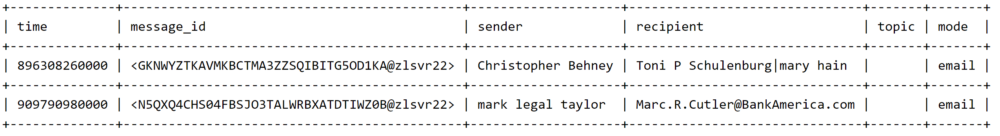

The input data file is organized as follows

there are approximately 200k plus rows of data. The topic column is always blank and mode is always email. Note that the headers were not in
the original data file but displayed here for clarity. 

The challenge for this exam is to write a script that will create one csv file and two visualizations. For the first question, the csv file
that needs to be created is a table with three columns: person, sent, and received. The sent and received columns are counts of how many
emails were sent or received by a given person. The table will be sorted in descending order, based on the number of sent emails. 

## Data Preprocessing 
First part of my script involves adding headers to the file as well as cleaning the data. The cleaning is from a file called
Dictionary to clean names.csv. Some of the sender's name in the original data file had multiple names for one person, e.g.
mark legal taylor and mark taylor are the same person. The Dictionary to clean names.csv file has a column for the original names as presented
in the original dataset and a column for the revised name that I will be using. Thus, from the above example, every instance of 
mark legal taylor or variations of this name will be transformed to mark taylor. This will allow us to accurately group people's name and
get a correct count of emails sent. The same process has been applied to the recipients column after I have separated each recipient's name
by a pipe and assigned this expanded data into its own dataframe. 

I converted all sender's name to lowercase so names would be aligned when grouping. I also converted the unix time to regular time but kept
only the year and the month. I initially included "day" in the time conversion but found that it was incredibly slow to plot a graph with 
time as an axis. This was because the top sender had sent thousands of emails and converting each sent date to a datetime object and appending
to a list for later graphing took the program a long time. By rounding the dates to a month, I would be able to batch the dates together and
passed in batched dates to the datetime object at once, speeding the process. 

## Question 1
I then created a dictionary called dict_for_number_msgs_sent_by_sender. The resulting dictionary would look something like this for example:
{jeff dasovich:1000, sara shackleton: 900....}. This would be used for the sent column for question 1. At the same time, I created a dictionary
called dict_senders_number_msgs_per_time and list_of_senders_time. The dictionary looks like 
{jeff dasovich :[(1, '2002-06')], sara shackleton: [(2, '2002-11')]....} and the list is a list of tuple that looks as follows
[(jeff dasovich , 2002-06), (sara shackleton, 2002-11)...]. The dictionary will be directly used for question two as it gives us the sender's
name, and number of messages that was sent in a given period of time. 

***detour to explain reasoning for list_of_senders_time***
The list is created by going in the original dataset and making a tuple of both the sender and the time they sent a message. This will be useful for question 3, as I will expand the "recipients" column by parsing the
column by pipes and creating a separate dataframe from that one column. I will then go through that dataframe, convert the value of each cell to
"False" if the cell value is not one of the top 5 senders names and record the column and row address where the cell value is one of the
top senders. Thus, a list of tuples for the sender and time is needed as I will need to associate this tuple with the relevant recipient
and this also avoids having to go through the dataframe row by row, which is time expensive. 

To finish explaining the rest of the logic for question 1, I sorted the dict_for_number_msgs_sent_by_sender based on who had sent the most messages.
I then parsed the recipient dataframe by the pipe symbol to get each recipient into a cell and created a dictionary of the number of messages each recipient
received, dict_for_msgs_received_by_recipient. For both the dict_for_number_msgs_sent_by_sender and dict_for_msgs_received_by_recipient, I placed
the key, which is the person's name into a list to create a master list of names. I then created the csv file, by placing the name from the master
list onto each row and asking the associated numbers from both dictionaries. 

## Question 2
From the dict_for_number_msgs_sent_by_sender created in part one, filter this list by the list of the top senders and graph. 

## Question 3
The first step to tackling this question was mentioned briefly in question 1 above. To reiterate, I parsed the recipients column by the pipe
symbol so that each recipient's name was assigned to its own column and created a separate dataframe from the parsed results. From the resulting
dataframe, I asked if each cell has the name in the list of top senders. If not, I would convert the cell value to "False". I would also
record the column and row address if the cell value was a name in the list of top senders. I then created a list that had 5 inner lists (since
I am counting only the top 5 senders). Each inner list is a tuple of the recipient (which was one of the top sender) the sender and the time. 
From each inner list, I then performed a loop that kept track of whether a sender has been seen or not. If a sender has not been seen, 
then the date and a count of the number of messages on that date would be tracked on a dictionary. This gave me list_top_sender_uni_num_msgs_uni_time,
which looks something like:

[('jeff dasovich', [13, 40, 5, 32, 14, 43, 25, 5, 17, 11, 8, 33, 10, 40, 36, 5, 6, 4, 7, 5, 4, 4, 2, 3, 1, 2, 10, 3, 1, 2], ['2000-04', '2001-07', '1999-09', '2001-10', '2000-08', '2001-06', '2000-09', '2000-06', '2000-10', '2000-02', '1999-11', '2001-08', '1999-10', '2000-12', '2000-11', '2001-11', '1999-12', '2000-03', '2001-01', '2001-12', '2000-05', '2001-05', '2001-02', '2001-09', '2002-02', '2001-04', '2000-01', '2001-03', '2002-01', '2000-07'])...] 

For example, this is saying that jeff dasovich received 13 emails on 2000-04. 

This result is then plotted. 
